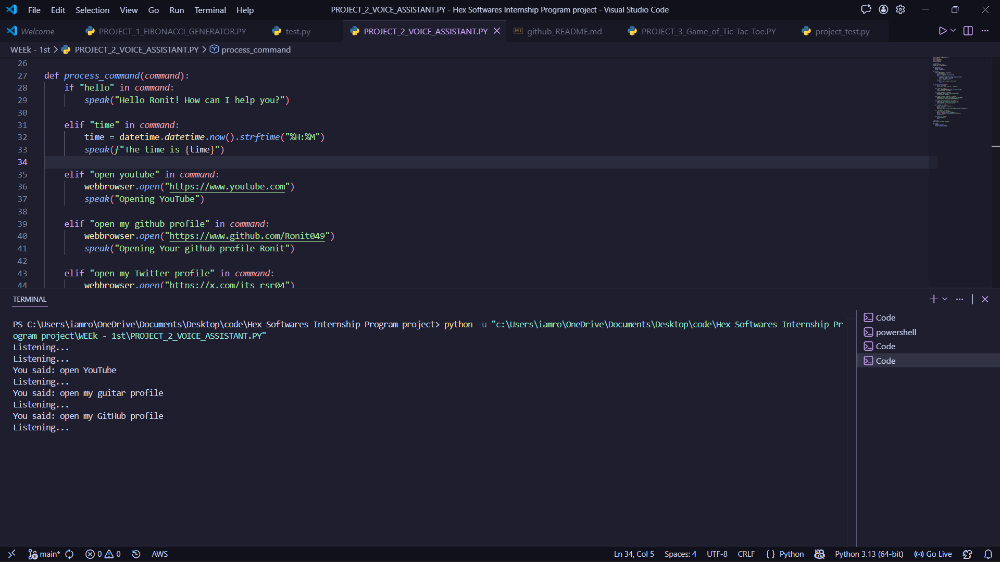

# 🎙️ HexVoice-AI


A smart and customizable **Voice Assistant built using Python** that can perform tasks like opening applications, searching the web, telling time, and more — all using your voice!

---

## 🚀 Features

* 🎤 Voice Recognition
* 🗣️ Text-to-Speech Response
* 🌐 Open Websites (Google, YouTube, etc.)
* ⏰ Tell Time & Date
* 📂 Open Applications
* 🔍 Search Anything Online
* 🤖 Custom Commands Support

---

## 🛠️ Tech Stack

* Python
* SpeechRecognition
* pyttsx3
* datetime
* webbrowser
* os

---

## 📸 Demo Screenshot



---

## ⚙️ Installation

### 1️⃣ Clone the Repository

```bash
git clone https://github.com/Ronit049/HexVoice-AI.git
```

### 2️⃣ Navigate to Project Folder

```bash
cd HexVoice-AI
```

### 3️⃣ Install Dependencies

```bash
pip install -r requirements.txt
```

---

## ▶️ Usage

Run the project using:

```bash
python main.py
```

### 💬 Example Commands

* "Open Google"
* "What is the time?"
* "Search Python tutorials"
* "Open YouTube"

---

## 📂 Project Structure

```
HexVoice-AI/
│
├── main.py
├── requirements.txt
├── README.md
└── assets/
    └── screenshot.png
```

---

## 💡 Future Improvements

* Add GUI Interface (Tkinter / PyQt)
* Integrate AI-based responses
* Add Wake Word Detection
* Multi-language support

---

## 🤝 Contributing

Contributions are welcome!

1. Fork the repository
2. Create a new branch (`feature-branch`)
3. Commit your changes
4. Push to your branch
5. Open a Pull Request

---

## 📜 License

This project is licensed under the **MIT License**.

---

## 🙌 Acknowledgment

This project was developed as part of my internship at **Hex Software**.

---

## 📬 Connect with Me

* GitHub: https://github.com/Ronit049
* LinkedIn:https://linkedin.com/in/ronit-raj7497

---

⭐ If you like this project, please give it a star!
